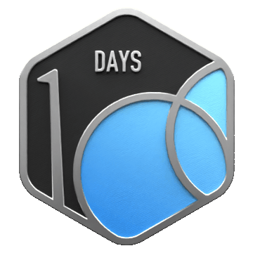

<h3 align="right">🎓 PhD Aspirant</h3>

<h2 align="center">Software Engineer | Machine Learning | Data Science</h2>

## 🧑‍🏫 Volunteer-Taught Courses

- [CS106A: Code in Place – Stanford University](https://digitalcredential.stanford.edu/check/BF89152F6E34DEB3C62341BF6B7A9773FC0BEA3449762CBEC259077FEFC1F632SlVZOGEwTUI4MDdnZFh2Y3hwbHRMdmJnczg4U2g0K2hrUllxN0taclpuVC9PWXZE)  
  *Served as a Section Leader (Spring 2025), teaching Python fundamentals to global students.*
- [Python for Absolute Beginners](https://github.com/abubakar2029/Python-Volunteer-Training.git)  
  *Designed and delivered a volunteer training course for new programmers.*
- [English Test Preparation Course](https://docs.google.com/spreadsheets/d/1utjZ2UN5hOI7KhylekVldX_RYV1U-8io2o5VLspsJsE/edit?usp=sharing)  
  *Guided students preparing for the Duolingo English Test.*

## 🎤 Delivered Workshops & Webinars

- [Meta Hacker Cup – Info Session](https://youtu.be/PaRx6nxlf6I)  
  Introduced students of my university to *Meta’s global coding competition.*

## 🌍 International Hackathons

- **Mentor Match AI** – [GitHub](https://github.com/abubakar2029/MentorMatch.AI) • [Submission](https://devpost.com/software/mentormatch-ai-powered-career-mentorship-finder)  
  *A platform that allows mentees to connect with potential mentors (who are willing to share their experiences and guide juniors).*

- **LeetCode Agent** – [GitHub](https://github.com/abubakar2029/LeetCode-Agent-Backend) • [Submission](https://lablab.ai/event/internet-of-agents/peka-coders/leetcode-agent)  
  *An agent that analyzes your GitHub repo, recommends a daily problem, and automates the tasks.*

- **Chat Market** – [GitHub](https://github.com/marksk1/chatmarket-mvp) • [Submission](https://lablab.ai/event/raise-your-hack/agentic-marketplace-prosus-track/chat-market)  
  *An agent powered platform to buy and sell products*

- **Green Scan** – [GitHub](https://github.com/abubakar2029/GreenScan-AI-Powered-Sustainable-Product-Recommender) • [Submission](https://devpost.com/software/eco-factor)  
  *AI recommender for sustainable, eco-friendly products.*

- **GPT-5O (AMRRA)** – [GitHub](https://github.com/Leanstix/AMRRA) • [Submission](https://lablab.ai/event/co-creating-with-gpt-5/dreamers/amrra)  
  *A mini AI research lab, a system that combines retrieval, structured extraction, experimentation, and judgment.*

## 💻 University & Personal Projects

- **Nursery Management (Java – OOP)** – [GitHub](https://github.com/abubakar2029/Nursery-Management-OOP-Java.git)  
  *Developed a nursery record management system implementing OOP principles*

- **Relational Database for Multi-Seller Food App** – [GitHub](https://github.com/abubakar2029/FullStack_Food_App/tree/main/Database)  
  *Developed a database schema design, SQL implementation, and diagrams for a multi-seller food delivery platform.*

- **School Management System (C#)** – [GitHub](https://github.com/abubakar2029/School-Managment-System-C-.git)  
  *Developed a desktop application for managing student and staff records (semester project).*

- **Jungle Scout Website Clone** – [GitHub](https://github.com/abubakar2029/Jungle-Scout-Website)  
  *Front-end clone of a product analytics platform.*

## 🧑‍🔬 About Me

My motive is to contribute to autonomous systems and projects that enhance human well-being. I am interested in Machine Learning, AI, and Data Science.

✅ Alongside my technical skills, I completed a 3-month long on-site **career development** fellowship by Stanford University in Pakistan where I strengthened skills in time management, communication, teamwork, and presentation

  
  
  

  
  
  

