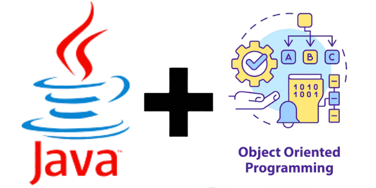
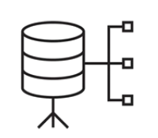
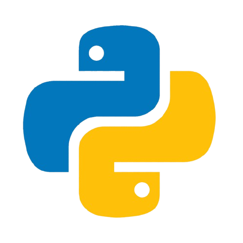
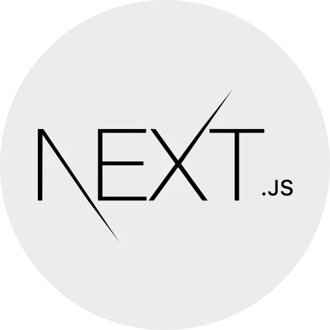

<h2 align="center"> Java | Spring Boot | React.js </h2>

## About Me / Education

I strive to write clean, scalable code and deliver projects in a timely manner.

- Solved **200+ LeetCode problems** to strengthen problem-solving ability  
- Invested **72 hours onsite** and **160 hours online** at **Career Development Fellowship Training (Amal Academy)**  
- **C1 English Proficiency** — Duolingo **130 / 160** (~ IELTS 7.0)

### Let’s Connect

  
  

## 🚀 Nominated Projects

<table>
<tr>
<td width="50%" valign="top">

  

<h5>Mobile Responsive UI Clone</h5>

Focused on layout precision, responsiveness, and component structure.

**Project Link:** [View Live](https://jungle-scout-website-u17b.vercel.app/)  
**Code:** [View Repository](https://github.com/abubakar2029/Nursery-Management-OOP-Java.git)

</td>

<td width="50%" valign="top">

  

<h5>Object-Oriented System Design</h5>

Analyzed System requirements, entities, and workflows of a Nursery Management.  
Designed the system using strong Object-Oriented principles.

**Code / Documentation:** [View Project](https://github.com/abubakar2029/School-Managment-System-C-.git)

</td>
</tr>

<tr>
<td width="50%" valign="top">

  

<h5>Relational Database Design</h5>

Designed a structured relational database for a multi-seller food platform.  
Documentated Schema with entity relationships and constraints.

👉 **Code / Documentation:** [View Repository](https://github.com/abubakar2029/FullStack_Food_App/tree/main/Database)

</td>

<td width="50%" valign="top">

  

<h5>WhatsApp Agent with Conversation Context</h5>

With a cost of <b>$22/month</b> this agent can support 900 or less customers.

👉 **MVP Code:** [View Repository](https://github.com/abubakar2029/whatsapp_bot.git)

  
</td>
</tr>
</table>

## 🎓 Volunteer Teaching

<table width="100%">
<thead>
<tr>
<thead>
<tr>
<th>Program</th>
<th width="20%"></th>
<th width="32%">certificate/recordings</th>
</tr>
</thead>
<tr>
<td><b>CS106A:</b> Code in Place — Stanford University </td>
<td style="border:1px solid #ddd;padding:8px;width:30%;text-align:center;vertical-align:middle;">
  
</td>
<td><a href="https://digitalcredential.stanford.edu/check/BF89152F6E34DEB3C62341BF6B7A9773FC0BEA3449762CBEC259077FEFC1F632SlVZOGEwTUI4MDdnZFh2Y3hwbHRMdmJnczg4U2g0K2hrUllxN0taclpuVC9PWXZE">View Certificate</a>
</td>
</tr>
<tr>
<td>Python for Absolute Beginners</td>
<td style="border:1px solid #ddd;padding:8px;width:30%;text-align:center;vertical-align:middle;">
  
</td>
<td><a href="https://github.com/abubakar2029/Python-Volunteer-Training.git">View Live recordings</a>
</td>
</tr>
<tr>
<td>English Test Preparation Course</td>
<td style="border:1px solid #ddd;padding:8px;width:30%;text-align:center;vertical-align:middle;">
  
</td>
<td><a href="https://docs.google.com/spreadsheets/d/1utjZ2UN5hOI7KhylekVldX_RYV1U-8io2o5VLspsJsE/edit?usp=sharing">View Live recordings</a>
</td>
</tr>
<tr>
<td>Latest Trends in Technology</td>
<td style="border:1px solid #ddd;padding:8px;width:30%;text-align:center;vertical-align:middle;">
  
</td>
<td><a href="YOUR_CERTIFICATE_LINK_1">View Certificate</a>
</td>
</table>

## 🧰 Nominated Tech Stack

   &ensp;
  
  &ensp;
  &ensp;
  

